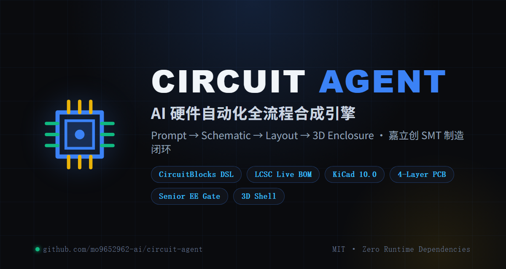
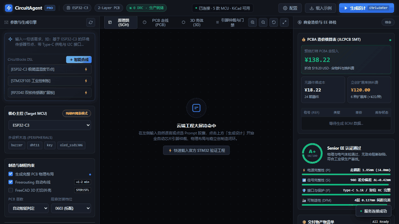

<p align="center">
  
</p>

# CircuitAgent · Community Edition

<!-- mcp-name: io.github.mo9652962-ai/circuit-agent-client -->

**Prompt → Schematic → Layout → 3D Enclosure → Fabrication Bundle**

<p align="center">
  <a href="https://github.com/mo9652962-ai/circuit-agent/actions/workflows/ci.yml"></a>
  <a href="LICENSE"></a>
  <a href="https://www.python.org/downloads/"></a>
  <a href="tests/"></a>
  <a href="https://github.com/mo9652962-ai/circuit-agent/releases"></a>
  <a href="https://github.com/modelcontextprotocol/registry"></a>
  
</p>

<p align="center">
  <a href="README.md"><b>🇨🇳 中文说明</b></a>
  ·
  <a href="README_EN.md"><b>🇬🇧 English</b></a>
  ·
  <a href="#-mcp-server-接入">🔌 MCP Server</a>
  ·
  <a href="#-支持的电路积木清单">🧩 19+ 积木清单</a>
  ·
  <a href="#-工业-dfx-制造审查与安全仿真">🏭 工业 DFX</a>
  ·
  <a href="#-eda--制造数据导出">📐 KiCad/BOM 导出</a>
  ·
  <a href="https://github.com/mo9652962-ai/circuit-agent/issues">💬 反馈</a>
</p>

> **Status: alpha.** This repository is the open community layer of CircuitAgent: the
> hardware DSL, the LCSC live-selection client, and the data contracts that the
> full compiler consumes. The block set is deliberately small and every block is
> unit-tested — correctness over coverage.

---

## 为什么需要这一层 (Why this layer exists)

让大语言模型直接生成底层走线、焊盘与封装，几乎必然产出非法几何或引脚短路。
CircuitAgent 的做法是把 LLM 的输出**约束在预验证的电路积木上**，再用 Pydantic
契约把它变成确定性网表 —— 模型只负责"选积木"，不负责"画线"。

<p align="center">
  
</p>

```text
Natural language prompt
        │
        ▼
┌────────────────────────┐
│  CircuitBlocks DSL     │  keyword → audited sub-circuits (deterministic)
└────────────────────────┘
        │
        ▼
┌────────────────────────┐
│  Netlist contract      │  Pydantic / JSON Schema (SSOT)
└────────────────────────┘
        │
   ┌────┴─────┐
   ▼          ▼
┌────────┐ ┌──────────────────┐
│ LCSC   │ │ REST / MCP APIs  │
│ client │ │ (community layer)│
└────────┘ └──────────────────┘
```

---

## 快速上手 (Quick Start)

**方式 A · 从 PyPI 安装（推荐）**

```bash
pip install circuit-agent-client
```

**方式 B · 从源码使用**

```bash
git clone https://github.com/mo9652962-ai/circuit-agent.git
cd circuit-agent
```

**零运行时依赖** —— 纯 Python 标准库实现，装完即用，不拉任何第三方包。
跑测试才需要 dev extra：`pip install -e ".[dev]"`

### 1 · 一句话生成硬件网表

```python
from client.synthesizer import synthesize_from_prompt

spec = synthesize_from_prompt(
    "基于 ESP32-C3 的环境监测节点，带 Type-C 供电、I2C 传感器插座、指示灯和2个按键"
)

print(spec["chip_id"])                            # ESP32-C3
print(len(spec["modules"]))                       # 元器件数
print(spec["netlist"]["connections"][0])          # 第一条网络连接
print(spec["unmatched"])                          # 你要求了、但 DSL 还不支持的模块（可执行信号）
print(spec["not_requested"])                      # 你没提到的可选模块（仅参考，非能力缺口）
```

映射是**确定性的**：同一句话永远产出逐字节相同的结果（CI 中有对应断言）。

`unmatched` 与 `not_requested` 是两个**刻意分开**的信号，不要混用：

| 字段 | 含义 | 例子 | 消费方式 |
|:---|:---|:---|:---|
| `unmatched` | 你**明确要求**、但当前 DSL **造不出来** | `ethernet` / `relay` / `motor_driver` | 这是能力信号，agent 应据此告知用户或换方案 |
| `not_requested` | 可选积木，只是这句话**没提到** | `button` / `led` / `buzzer` / `i2c` / `crystal` | 纯参考信息，不代表能力缺口 |

**不会被静默丢弃**：任何未识别的意图都会出现在 `unmatched` 里，而不是悄悄消失。

### 2 · 查询立创商城实时库存与单价

```python
from client.lcsc_client import search_lcsc_parts

for part in search_lcsc_parts("CH340N", limit=3):
    print(f"[{part['lcsc_part']}] {part['part_number']} | {part['package']} | "
          f"库存 {part['stock']} | ${part['price_usd']} | {part['part_class']}")
```

```text
[C506813] CH340N | SOP-8_L5.0-W4.0-P1.27-LS6.0-BL | 库存 196 | $0.5537 | Extended Part
```

客户端自带**重试退避 + 硬超时 + 24 小时磁盘缓存 + 防御式解析**：上游改结构不会
抛异常，断网时回落到缓存（缓存也没有则返回空列表，调用方永远不必处理传输层异常）。

### 3 · 直接用积木搭电路

```python
from client.circuit_blocks import block_usb_c_power, block_power_ldo_3v3

blk = block_power_ldo_3v3()
for comp in blk.components:
    print(comp.ref, comp.value, comp.package, comp.lcsc)
```

---

## 积木清单 (Block Catalogue)

| Block | 说明 | 关键设计点 |
|:---|:---|:---|
| `block_usb_c_power` | Type-C 供电输入 | 双 5.1k CC 下拉（sink 角色，非 56k 上拉） |
| `block_power_ldo_3v3` | AMS1117-3.3V 稳压 | 10µF 输入/输出储能电容 |
| `block_crystal_clock` | 无源晶振 + 负载电容 | 标记 `guard_ring` 属性供后端加地屏蔽环 |
| `block_button` | 消抖按键 | 10k 上拉 + 100nF RC，位号可参数化 |
| `block_led` | 状态指示灯 | 限流电阻 + 颜色/阻值可参数化 |
| `block_buzzer` | 蜂鸣器驱动 | S8050 NPN + 1N4148W 反向续流二极管 |
| `block_i2c_header` | I2C 扩展排针 | SCL/SDA 各 4.7k 上拉 |
| `block_rs485_transceiver` | SP3485 半双工差分串口 | 120Ω 终端电阻 + 100nF 去耦 + 3P 排针引出 |
| `block_can_transceiver` | SN65HVD230 3.3V CAN 节点 | 120Ω 终端匹配 + 10k 斜率控制 (高速模式) |
| `block_battery_tp4056` | TP4056 1A 线性锂电充电 | 1.2k 限流 + 充/满双色指示灯 + 2P 电池端子 |
| `block_sensor_aht20` | AHT20 温湿度传感器 | 工业 I2C 总线 + 去耦电容 + DFN-6 封装 (C2757850) |
| `block_sensor_mpu6050` | MPU-6050 6轴 IMU 运动姿态传感器 | 3轴陀螺仪+3轴加速度计 + 旁路去耦 + QFN-24 (C24112) |
| `block_esd_usb_tvs` | USB 接口高速 TVS 静电防护 | USBLC6-2SC6 超低结电容 (0.6pF) + SOT-23-6 |
| `block_esd_rs485_tvs` | RS-485 工业双向非对称 TVS | SM712 工业防雷/抗浪涌防静电二极管 (-7V~+12V) |
| `block_esd_can_tvs` | CAN 总线 ESD 双路 TVS 阵列 | PESD1CAN 24V 车规/工控双线 TVS (SOT-23) |
| `block_reverse_polarity_protection` | 工业电源输入防反接保护 | 肖特基二极管 (SS34) 或 低压降 P-MOSFET (AO3401A) |
| `block_power_pi_filter` | 电源输入 EMI π型 LC/RC 滤波器 | 磁珠 (100MHz 600Ω) + 10µF 钽电容/陶瓷电容吸收纹波 |
| `block_fiducial_marks` | SMT 贴片光学定位点 (Mark点) | 3个 1.0mm 裸铜焊盘 + 2.0mm 阻焊开窗 (DFA工序必备) |
| `block_testpoint_matrix` | 自动化测试点矩阵 (Test Points) | 1.0mm SMD 测试铜焊盘 (支持电源轨、地轨、SWD、UART测试) |
| `block_watchdog_supervisor` | TPS3823 看门狗/复位监控 | 1.6s WDI 喂狗 + 推挽复位输出（工业 MCU 防跑飞，IEC 61508 实践） |

每个积木的引脚号、LCSC 料号、封装名在冻结前均对照数据手册与立创商城列表核验过。
`tests/test_circuit_blocks.py` 会强制校验：位号唯一、每个元件都有封装与料号、
网络端点必须指向已声明的元件、每个积木都必须接 `/GND`。

---

## MCP Server (AI Agent 工具服务)

CircuitAgent 内置标准 JSON-RPC 2.0 stdio MCP Server，基于纯 Python 标准库构建（无需任何第三方 pip 库），可无缝接入 **Claude Desktop**、**Cursor** 或 **Windsurf**。

当前暴露 **15 个工具**、8 个资源（`circuit://` URI）与 4 个工程提示词（slash-command）。

### 运行方式
```bash
python -m client.mcp_server
```

### Claude Desktop 配置 (`claude_desktop_config.json`)
```json
{
  "mcpServers": {
    "circuit-agent": {
      "command": "python",
      "args": ["-m", "client.mcp_server"],
      "cwd": "/path/to/circuit-agent"
    }
  }
}
```

### 暴露的工具 (Tools)
1. `synthesize_circuit`: 输入自然语言，输出确定性硬件网表与积木清单。
2. `search_lcsc_parts`: 免 Key 实时查询立创商城的元器件库存、封装、阶梯单价与基础库/扩展库属性。
3. `list_circuit_blocks`: 列出 DSL 中全部可用的 20 大已审计电路积木规格。
4. `validate_netlist`: 根据正式 JSON Schema 校验网表数据结构合法性。
5. `calculate_trace_impedance`: 基于 IPC-2141 解析公式计算微带线与差分对走线阻抗（50Ω RF / 90Ω USB / 120Ω CAN/485）。
6. `calculate_bom_cost`: PCBA 成本核算器，自动精算元器件裸成本与嘉立创扩展库换料费（¥20/种）。
7. `list_supported_chips`: 查询当前支持的微控制器型号及其引脚分配硬规则。
8. `register_custom_chip`: 动态注册第三方 MCU 物理引脚约束与外设映射表。
9. `calculate_ipc2152_trace_current`: 依据 IPC-2152 标准精确计算印制导线载流能力或反算线宽（温升 ΔT、铜厚 1oz/2oz、内层降额）。
10. `audit_industrial_dfx`: 工业级 DFX (DFM/DFA/DFT/DFC) 与生产合规自动化静态审查器，输出打分评级、问题分类与 Markdown 体检报告。
11. `export_kicad_netlist`: 导出 KiCad 可导入的网表文件。
12. `export_manufacturing_bom`: 导出 JLCPCB 制造 BOM（含 LCSC 料号与成本）。
13. `calculate_parametric_circuit`: 参数化电路计算器（RC 滤波 / I2C 上拉 / LDO 热耗散 / 分压器）。
14. `render_circuit_topology`: 渲染 ASCII 电路拓扑图，快速目检连接关系。
15. `run_erc`: 网表级电气规则门禁（ERC）——悬空网络、缺 GND、未知位号、缺电源域、缺去耦电容，每条带 severity 与出处，blocking/error 阻断 BOM/CPL 交付。
11. `export_kicad_netlist`: 导出标准 KiCad S-Expression 网表 (.net)，支持 KiCad 6/7/8/9/10 直接导入 Pcbnew 快速布线。
12. `export_manufacturing_bom`: 生成量产级嘉立创 SMT BOM CSV 表格（含位号聚合、基础库免换料费分类）。
13. `calculate_parametric_circuit`: 闭环参数化硬件设计方程（E96 标准分压电阻对求解、LDO 散热结温校核、I2C 上拉阻值及 RC 滤波）。
14. `render_circuit_topology`: 生成结构化 ASCII 系统架构拓扑图（电源轨、总线、传感器与保护子系统）。

### 暴露的资源 (Resources)
支持通过 `circuit://` URI 直接将规范加载到大模型上下文，无需执行额外工具：
- `circuit://specs/netlist-schema`: 完整的网表 Draft-07 JSON Schema。
- `circuit://specs/cpl-standard`: 嘉立创 SMT 坐标规范与封装偏角补偿表。
- `circuit://specs/ipc-dfx-rules`: IPC-2152 导线载流/温升与 IPC-2221 电气间隙/爬电距离硬规则。
- `circuit://blocks/catalog`: 20 大电路积木的元器件、引脚与网络全量清单。
- `circuit://rules/jlc-smt`: 嘉立创四层板叠层 (JLC04161H) 与生产物理规则。
- `circuit://examples/esp32c3-minimal`: ESP32-C3 极简温湿度节点参考网表。
- `circuit://examples/stm32f103-controller`: STM32F103 工业控制板参考网表。
- `circuit://examples/rp2040-dualcore`: RP2040 双核传感器扩展板参考网表。

### 快捷工程 Prompt (Slash-Commands)
- `/design_hardware_project`: 全流程硬件设计指令（积木匹配 → 阻抗计算 → BOM核算 → 网表校验）。
- `/audit_schematic_netlist`: Senior EE 硬件体检审查指令（去耦电容亲和性、差分对等长、Type-C 下拉阻抗）。
- `/optimize_bom_cost`: PCBA 降本优化指令（分析扩展库物料并推荐免换料费的基础库替代料）。
- `/audit_industrial_compliance`: 工业与量产级 DFX 审查指令（核查 IPC-2152 载流温升、IPC-2221 电气间隙、DFT 测试点覆盖率与 TVS 端口抗浪涌防护）。

---

## 数据契约 (Contracts)

- [`specs/netlist_schema.json`](specs/netlist_schema.json) — 网表 JSON Schema
- [`specs/cpl_standard.md`](specs/cpl_standard.md) — 嘉立创 SMT 坐标规范与封装偏角补偿表
- [`examples/`](examples/) — STM32F103 / ESP32-C3 / RP2040 参考网表，CI 强制校验其符合 Schema

---

## 测试与 CI

```bash
pytest tests/ -q      # 240 passed
```

CI 在 `ubuntu-latest` + `windows-latest` × Python 3.10/3.11/3.12 上跑全量测试，
并额外做两件事：校验 `examples/` 全部符合 Schema、离线跑通 README 里的快速上手命令。

---

## 范围与路线图 (Scope & Roadmap)

**本仓库包含**：硬件 DSL 与积木库、立创实时选型客户端、网表/CPL 数据契约、标准 MCP Server、REST 交互接口。

**暂不包含**：多层板物理布局与布线求解、参数化 3D 壳体布尔几何、Senior EE 物理规则门禁。
这些是上游编译器的高级能力，仍在开发中；本仓库通过稳定的数据契约与客户端接口与其对接，
契约本身是公开且版本化的。

路线图：

- [x] 积木库 + 确定性映射 + 单元测试
- [x] 立创实时选型客户端（重试/缓存/降级）
- [x] JSON Schema + 三份参考样例 + CI
- [x] 工业级实用积木（RS485 / CAN / TP4056 锂电）
- [x] 标准 MCP Server 实现（纯标准库）
- [x] 中英双语文档与官方门面 (Banner + Demo GIF)
- [x] 更多传感器积木（AHT20 温湿度 / MPU6050 六轴）
- [x] 支持自定义第三方芯片引脚分配映射规则
- [x] 工业 DFX 审查引擎（DFM/DFA/DFT/DFC）+ IPC-2152 / IPC-2221 规则库
- [x] EDA 与制造导出（KiCad 网表、嘉立创 BOM/CPL）
- [x] 参数化设计方程求解（E96 分压、LDO 热设计、I2C 上拉、RC 滤波）
- [ ] 多层板布局与布线求解器
- [ ] 参数化 3D 壳体生成

---

## 参与贡献 (Contributing)

最欢迎的贡献是**新增经过核验的电路积木**：带上数据手册依据的引脚定义与立创料号，
并补上对应单测即可提 PR。Issue 里也欢迎贴出你希望支持的芯片型号。

---

## 名称说明 (Naming)

"CircuitAgent" 是一个较通用的名字，社区中已有若干同名或近名的项目（例如
`singularguy/CircuitManus` 内部的 `CircuitAgent` 类、`Circuit-LLM/circuit-sdk`
的 `CircuitAgent` 基类、以及高能物理领域的 PhEDEx `CircuitAgent`）。
本项目与它们**没有任何关系**，也不主张该名称的独占权。如果你的项目或商标与此冲突，
欢迎开 Issue 告知，我们可以协商改名。

## ⭐ 关注与支持 (Star History)

如果 CircuitAgent 对你的硬件开发或制造流程有所帮助，欢迎点个 Star 支持项目持续演进！

<div align="center">

[](https://star-history.com/#mo9652962-ai/circuit-agent&Date)

</div>

## 许可证 (License)

[MIT](LICENSE) © 2026 sora
